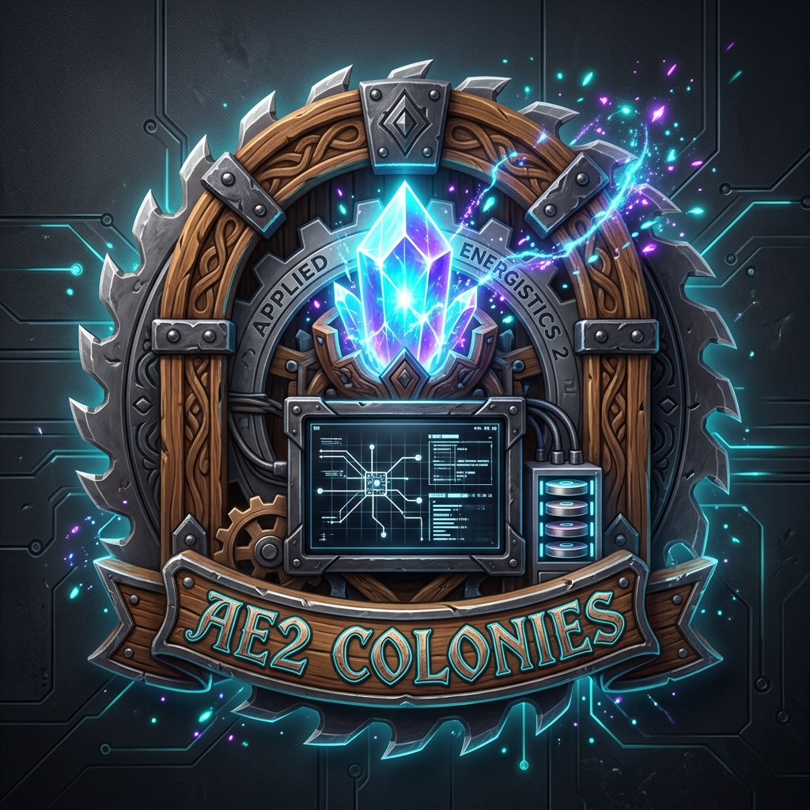

# 📦 AE2 Colonies (Applied Energistics 2 × MineColonies)



**Seamlessly integrate your MineColonies warehouse directly into your Applied Energistics 2 ME Network!**

Say goodbye to overflowing warehouse racks, manual sorting, and missing building materials. **AE2 Colonies** bridges the gap between MineColonies and AE2, empowering warehouse couriers and deliverymen to deposit and withdraw items straight from your digital ME storage, request automated AE2 crafting on the fly, and synthesize hundreds of **Domum Ornamentum** building blocks with zero recipe setup.

---

## ✨ Key Features

### 🖥️ 1. The ME Colony Terminal
- **True AE2 Network Device**: Connects directly via ME Glass Cables or Dense Cables (requires 1 ME channel and 1.5 AE/t idle power).
- **Automatic Warehouse Binding**: Simply place the terminal inside the boundary of your MineColonies Warehouse, and it links itself automatically.
- **In-Game Configuration GUI**: Right-click the terminal to access an interactive configuration screen:
  - **Deposit into AE2**: Automatically route incoming goods from your lumberjacks, miners, and farmers directly into digital ME storage.
  - **Withdraw from AE2**: Allow couriers to pull items straight from ME storage to fulfill citizen requests.
  - **Autocrafting on Demand**: If a citizen requests an item you don't currently have in storage, your AE2 system will automatically calculate and craft it.
  - **Live Job Monitoring**: View real-time status and active autocrafting counts.

---

### 🏃 2. Immersive NPC Courier Interaction
- **No Teleporting Magic**: Couriers physically pathfind to the ME Colony Terminal inside the warehouse.
- **Animated Withdrawals**: When picking up supplies for a citizen, the courier walks up to the terminal, queries the ME storage, plays an arm-swing interaction animation, and carries the items away.
- **Automated Overflow Dumps**: When couriers return with gathered resources, items are deposited directly into your ME network. If your ME system runs out of space or power, items gracefully fall back to physical warehouse racks.

---

### 🪚 3. ME Architect's Cutter & Domum Ornamentum Integration
Domum Ornamentum features hundreds of timber frame, shingle, paper wall, and pillar combinations—making manual pattern encoding for your builders practically impossible. **AE2 Colonies solves this completely.**

- **The ME Architect's Cutter Machine**:
  - An authentic AE2 machine block connected to your ME network (1 channel, 2.0 AE/t idle power, 10 AE/t active power).
  - Features dynamic visual states with glowing cyan neon blade indicators when online.
  - **Zero-Setup Colony Synthesis**: As long as an active ME Architect's Cutter is connected to your network, the **ME Colony Terminal automatically crafts any Domum Ornamentum block** requested by your builders using raw materials (wood, terracotta, clay, paper) in your ME storage!
- **Player Autocrafting & Pattern Providers**:
  - Slot in 1 sample block into the **Pattern Slot** (not consumed, functions like an Inscriber press).
  - Connect an **AE2 Pattern Provider** to automate any specific DO block design for your personal building projects.
  - Finished blocks **auto-eject** back into adjacent Pattern Providers or storage chests.

---

## 🛠️ Recipes

### ME Colony Terminal
```
[ Iron Ingot ]  [ Fluix Crystal ]  [ Iron Ingot ]
[  MC Rack   ]  [  AE2 Terminal ]  [  MC Rack   ]
[ Iron Ingot ]  [ Fluix Crystal ]  [ Iron Ingot ]
```

### ME Architect's Cutter
```
[ Iron Ingot ]  [ Fluix Crystal   ]  [ Iron Ingot ]
[ Form. Core ]  [ DO Arch. Cutter ]  [ Form. Core ]
[ Iron Ingot ]  [ Fluix Crystal   ]  [ Iron Ingot ]
```

---

## 📋 Requirements

- **Minecraft:** 1.21.1
- **Mod Loader:** NeoForge (21.1.169+)
- **Dependencies:**
  - Applied Energistics 2 (AE2)
  - MineColonies
  - Domum Ornamentum
  - GuideME

---

## 📜 License & Permissions

This project is licensed under the MIT License. Feel free to include **AE2 Colonies** in any modpack!